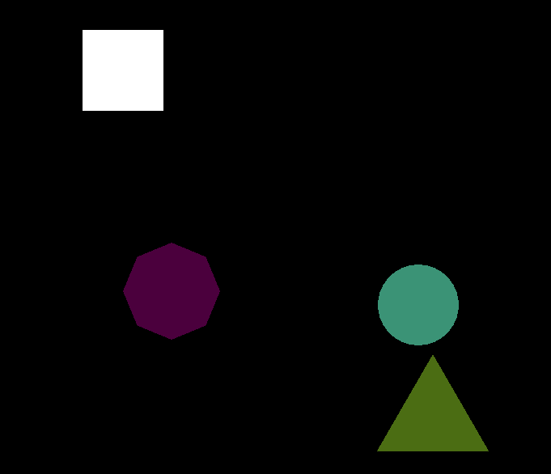

# Screen Saver

A simple screen saver created using [SFML](https://www.sfml-dev.org/)

**to compile:**

`g++ main.cpp -std=c++17 -lsfml-graphics -lsfml-window -lsfml-system -o ../bin/screen_saver`

Make sure to install **SFML** on your system before compiling the program. Refer to [SFML](https://www.sfml-dev.org/download.php)'s installation instructions for your platform.

---

> To open the screen_saver program after `compiling`:

- Navigate to the `bin` directory where the `screen_saver` executable is located.

- Run the `screen_saver` executable from the command line or terminal.
